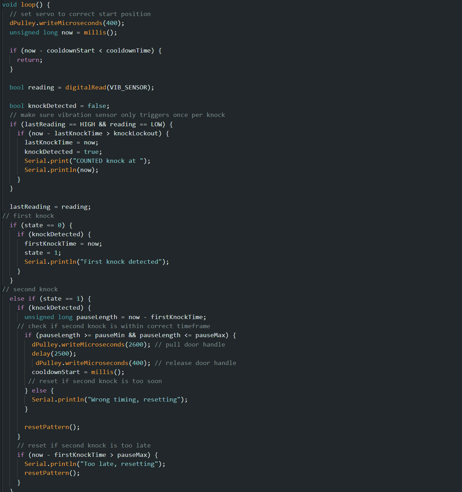
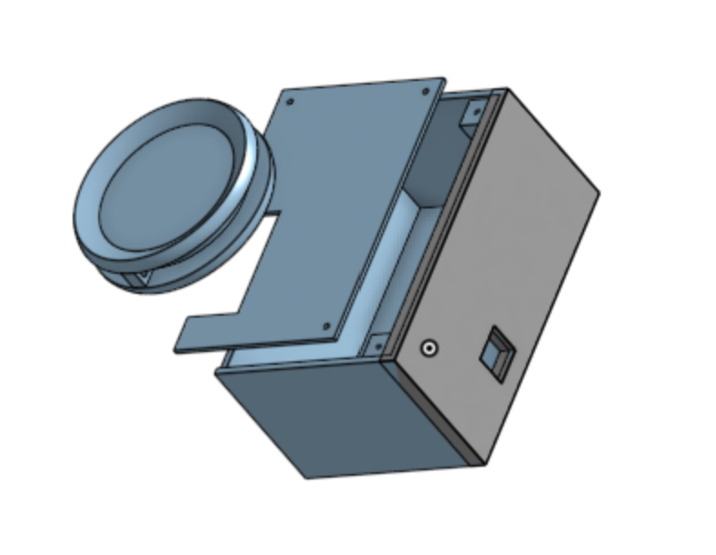

<h1>Automatic-Door-Opener</h1>

 ### [YouTube Demonstration](https://youtu.be/7eJexJVCqJo)

<h2>Description</h2>
Designed and built an automatic door opener using an Arduino, servo motor, and vibration sensor. The project was created to provide a keyless entry method for my dorm room and make access more convenient for friends. The system can be programmed with different knock patterns and only opens when the correct pattern is detected.
 

<h2>Languages and Utilities Used</h2>

- <b>Arduino</b> 
- <b>OnShape</b>

<h2>Design and Build Process:</h2>

Code:  

 
The Arduino continuously monitors the vibration sensor for knocks and, using timing-based logic, determines whether a knock pattern matches the programmed sequence. If the correct pattern is detected, the Arduino actuates a servo motor to pull the door handle mechanism before automatically resetting and waiting for the next input.
 
CAD:  

 
 
Finished Project:  
  
  

